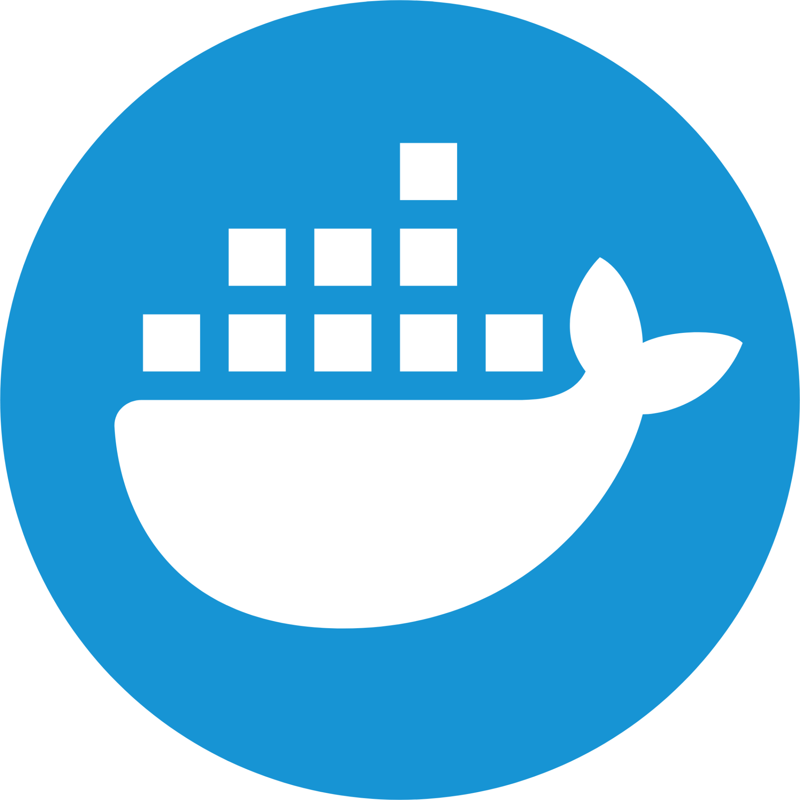

# Hi, I'm Sebastian ✨

Frontend-focused software developer with a passion for crafting exceptional user experiences and building high-quality, scalable software. Leverages React, Typescript, and Tailwind CSS to create intuitive and responsive interfaces. Implements SOLID principles for clean, maintainable, and extensible code. Proficient in NestJS and TypeORM for robust backend development. Prioritizes code quality, testing, and CI/CD for delivering realiable projects.

## Connect with me online:
- Check out my profile on <a href="https://www.linkedin.com/in/sebastianhernando/">LinkedIn</a>
- View my resume <a href="https://github.com/Mipmipp/Mipmipp/blob/main/assets/hernando-sebastian-resume.pdf">clicking here</a>

## My stack:
### Frontend
<table>
  <tr>
    <td align="center" width="96"> 
      
       React
    </td>
    <td align="center" width="96"> 
      
       Typescript
    </td>
    <td align="center" width="96"> 
      
       Tailwind
    </td>
    <td align="center" width="96"> 
      
       React Query
    </td>
    <td align="center" width="96"> 
      
       React Router
    </td>
    <td align="center" width="96"> 
      
       Formik & Yup
    </td>
     <td align="center" width="96"> 
      
       Cypress
    </td>
    <td align="center" width="96"> 
      
       Vite
    </td>
    <td align="center" width="96"> 
      
       Amplify
    </td>
  </tr>
</table>

### Backend
<table>
  <tr>
    <td align="center" width="96"> 
      
       NestJS
    </td>
    <td align="center" width="96"> 
      
       TypeORM
    </td>
    <td align="center" width="96"> 
      
       MySQL
    </td>
    <td align="center" width="96"> 
      
       Jest
    </td>
    <td align="center" width="96"> 
      
       SuperTest
    </td>
    <td align="center" width="96"> 
      
       Postman
    </td>
    <td align="center" width="96"> 
      
       AppRunner
    </td>
  </tr>
</table>

### Amazon Web Services
<table>
  <tr>
    <td align="center" width="96"> 
      
       Lambda
    </td>
    <td align="center" width="96"> 
      
       Cognito
    </td>
    <td align="center" width="96"> 
      
       RDS
    </td>
    <td align="center" width="96"> 
      
       IAM
    </td>
    <td align="center" width="96"> 
      
       S3
    </td>
    <td align="center" width="96"> 
      
       IVS
    </td>
    <td align="center" width="96"> 
      
       SES
    </td>
  </tr>
</table>

### Implementations
<table>
  <tr>
    <td align="center" width="96"> 
      
       Stripe
    </td>
    <td align="center" width="96"> 
      
       Stripe Connect
    </td>
    <td align="center" width="96"> 
      
       Stellar
    </td>
  </tr>
</table>

### Tools
<table>
  <tr>
    <td align="center" width="96"> 
      
       Docker
    </td>
    <td align="center" width="96"> 
      
       GitHub Actions
    </td>
    <td align="center" width="96"> 
      
       Sonarqube
    </td>
    <td align="center" width="96"> 
      
       ESlint
    </td>
    <td align="center" width="96"> 
      
       Prettier
    </td>
    <td align="center" width="96"> 
      
       Drawio
    </td>
    <td align="center" width="96"> 
      
       Figma
    </td>
  </tr>
</table>

### Work tools
<table>
  <tr>
    <td align="center" width="96"> 
      
       Scrum
    </td>
    <td align="center" width="96"> 
      
       Clickup
    </td>
    <td align="center" width="96"> 
      
       Slack
    </td>
  </tr>
</table>

### Others
<table>
  <tr>
    <td align="center" width="96"> 
      
       HTML
    </td>
    <td align="center" width="96"> 
      
       CSS
    </td>
    <td align="center" width="96"> 
      
       JavaScript
    </td>
    <td align="center" width="96"> 
      
       Bootstrap
    </td>
    <td align="center" width="96"> 
      
       Bootstrap React
    </td>
    <td align="center" width="96"> 
      
       Material UI
    </td>
    <td align="center" width="96"> 
      
       Framer Motion
    </td>
  </tr>
  <tr>
    <td align="center" width="96"> 
      
       NodeJS
    </td>
    <td align="center" width="96"> 
      
       Express
    </td>
    <td align="center" width="96"> 
      
       Rust
    </td>
    <td align="center" width="96"> 
      
       NextJS
    </td>
    <td align="center" width="96"> 
      
       Prisma
    </td>
    <td align="center" width="96"> 
      
       Shadcn
    </td>
    <td align="center" width="96"> 
      
       JWT.io
    </td>
  </tr>
  <tr>
    <td align="center" width="96"> 
      
       Passport.js
    </td>
    <td align="center" width="96"> 
      
       Bcrypt
    </td>
  </tr>
</table>
